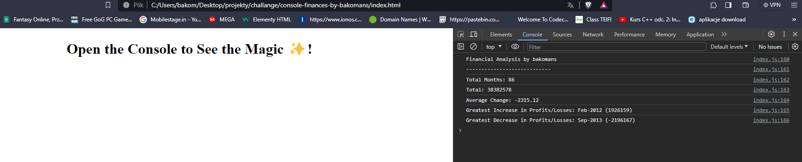

# console-finances-by-bakomans# Financial Analysis Project

This project involves analyzing a financial dataset to calculate various financial metrics. The dataset contains monthly records of profits and losses.

## Information

The dataset is stored in a JavaScript array named `finances`. It includes entries in the following format:

 JavaScript
[
  ['Month-Year', ProfitOrLoss],
  
]
## License 

This project is MIT license 

## Deployment 

URL: https://bakomans.github.io/console-finances-by-bakomans/

## Thanks 

Thank for everyone looking for this project !